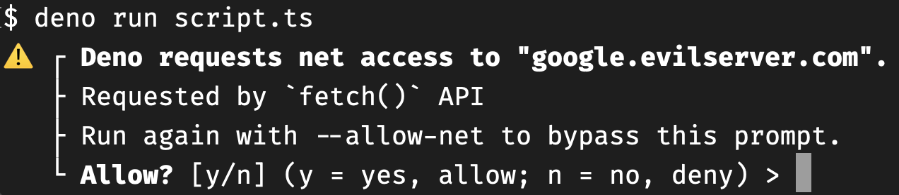
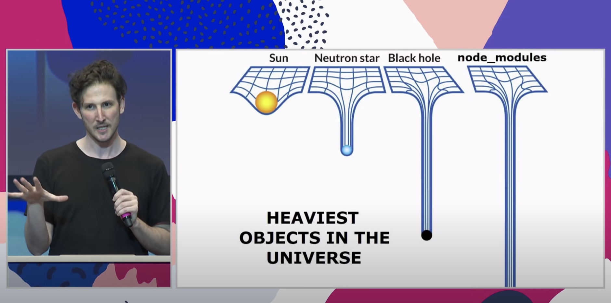

class: middle center no-number

<div style="display: flex; justify-content: space-evenly;">
  

  <div style="display: flex; flex-direction: column; justify-content: space-evenly; align-items: flex-end;">
    <span class="">
      About
      <span style="font-size: 40px; background-color: #eee; padding-left: 5px; padding-right: 5px; border-radius: 12px;">npm:</span>
      support
      <br/>of Deno
    </span>
    <small>Yoshiya Hinosawa @kt3k</small>
  </div>
</div>

---
class: bg-light-yellow

アジェンダ

- Deno のおさらい<!--5-->
- npm 互換性の話
  - 使い方 / デモ<!--10-->
  - 実装までの経緯<!--10-->
  - npm 互換性で変わらないこと<!--5-->

---
class: bg-light-yellow


自己紹介

日野澤歓也 / twitter @kt3k

Web エンジニア歴 13年

- <small>プロジェクト初期 (2018) からOSSとしての Deno 開発に参加</small>
- <small>2020年に Deno が会社化、その数カ月後に会社に誘われる</small>
- <small>2021年から Deno のフルタイムコミッターに</small>

<small>このあたりの経緯は Findy Engineer Lab の[Deno開発企業で私が働く理由](https://engineer-lab.findy-code.io/deno-kt3k)という記事にまとめられています</small>

---
class: middle center inverse

Deno のおさらい

---
class: middle center inverse

Deno とは

---
class: no-number

Deno とは
- 2018年から開発が始まってる新しい JS runtime
- オープンソースプロジェクト
- Node.js での反省を生かして Node.js の作者であるライアン・ダールが開発を始める


---
Deno の特徴1

# 整理されたランタイム

- Web 互換 API (fetch, Web Streams etc)
- 整理された Module システム
  - CommonJS なし、ES Module のみ
- URL 指定でモジュールをインポートする
  - ブラウザと同じ挙動
  - 実行時に依存を自動的に DL
  - npm install 的なものは無い

---
Deno の特徴2

# DX (開発体験) の改善

- 豊富な ビルトインツール
  - `deno lint`, `deno fmt`, `deno test` etc
- TypeScript もビルトイン
  - 設定 / インストール不要
- シングルバイナリ
  - デプロイが簡単

---
Deno の特徴3

# セキュリティ強化

- ネットワークアクセス時、ファイルアクセス時に権限チェックがある
  - サプライチェーン攻撃に強い

<p class="text-center">
  
</p>

---
class: middle center


おさらいここまで

---
参考文献

- Deno ってなんだっけ? - Qiita
  - <small>https://qiita.com/kt3k/items/e1647683ad08ff6b6e95</small>
- Denoとはなにか - 実際につかってみる - Qiita
  - <small>https://qiita.com/azukiazusa/items/8238c0c68ed525377883</small>
- Deno入門 - エンジニアハブ
  - <small>https://eh-career.com/engineerhub/entry/2022/06/17/093000</small>
- 公式マニュアル (英語)
  - <small>https://deno.land/manual</small>

---
class: middle center bg-sky

npm 互換性の話


---
class: middle center

使い方


---
Node.js の復習

例. `express` で hello world する

```ts
import express from "express";

const app = express();

app.get('/', (req, res) => {
  res.send('Hello World!');
});

app.listen(3000);
```

---
Deno npm 互換性

例. `express` で hello world する

```ts
import express from "npm:express";

const app = express();

app.get('/', (req, res) => {
  res.send('Hello World!');
});

app.listen(3000);
```

---
npm 互換性 概要

- `npm:` の後ろに npm モジュール名を指定した文字列から import できる
  - 例. `import chalk from "npm:chalk"`
- Deno が自動的にその npm モジュールをダウンロード & インポートしてくれる
- すべての npm モジュールがサポート対象

--

<p class="text-center">デモ</p>

---
デモで伝えたかったこと

- import の記法が少し変る以外は<span class="red">完全に同じコード</span>
  - つまり drop-in replacement であること

--
- npm モジュールを Deno のセキュリティの仕組みの中で動かせている事
  - Node.js より<span class="red">安全に</span> npm モジュールを実行できている事

---
npm 互換性 補足

- `npm:chalk@5.1.2` - バージョン指定可能

--
- `npm:chalk@^5` - semver レンジ指定可能

--
- 次のような import map を書くと、npm モジュール名から直接 import 可能

```json
{
  "imports": {
    "chalk": "npm:chalk"
  }
}
```
```js
import chalk from "chalk"; // <= npm:chalk にマップされる
```

---
npm 互換性の動作確認状況

- 動く
  - chalk, express, vite, react, prisma, etc...
- 動かない
  - astro, next, mocha, etc...

--

<br />
<p class="text-center">
<small>※全貌(何%動くか等)は正直分からない</small>
<p>
--

<p class="text-center">
<small>※要望の多いものからバグが潰されていくシステム 😅</small>
<p>

--

<p class="text-center">
<small>※バグ報告歓迎 🫶</small>
<p>


---
class: middle center bg-sky

npm 互換性 実装までの経緯


---
class: code-18
# タイムライン1 - 2018

- 明確に npm/Node 互換性を否定する方針で開発スタート
  - 実際 Node とは全く違う URLベースの module system が実装された

```js
import { serve } from "https://deno.land/std@0.160.0/http/server.ts";
import html, { h } from "https://deno.land/x/htm/mod.ts";
import UnoCSS from "https://deno.land/x/htm/plugins/unocss.ts";
```

---
class: no-number
# タイムライン2 - 2019/07

- URL ベース module system のデザインが安定したので、Node.js との互換性を検討しようと提案

<p class="text-center">
  <a href="https://github.com/denoland/deno/issues/2644" target="_blank"></a>
</p>

---

# タイムライン3 - 2019/11

- 標準モジュールの `node/` ディレクトリ以下で Node と互換性のある API の実装が始まる
  - その後各 Node.js API が粛々と実装され続ける

<p class="text-center">
  
</p>

---

# タイムライン4 - 2021

- Node 互換モードが実験的リリース
  - `deno run --compat` というコマンドで Node の API を持った Deno が動くようになる

```js
import fs from "fs"; // <= Node の fs が import される!

import express from "express";
// ^-- node_modules 以下の express が import される!
```

--

<p class="text-center">さすがに、デザインに対する懸念が強かった</p>

---
class: middle center inverse

実はここまでは正式に npm 互換性<br />についてのアナウンスをしていなかった

---
# タイムライン5 - 2022/08
- Big Changes Ahead of Deno というブログポストを発表
  - npm 対応をすると初めて公式に表明

<p class="text-center">
  
</p>

---
# タイムライン6

- 2022/08 `npm:` 機能が実験的リリース

--
- 2022/11 `npm:` 機能が正式リリース 🥳🎉

--

<br />
<p class="text-center">
<span style="text-decoration-line: underline; text-decoration-style: dotted;">⚠ npm 互換機能はリリースされたばかり</span>
</p>

--
<p class="text-center">
<span style="">💡 公式アナウンスからリリースまでは短かったものの仕込み自体は3年ぐらい前から</span>
</p>


---
class: middle center inverse

npm 互換性の葛藤

---
class: middle center

npm 互換性はコミュニティの中では<br />かなり反対意見の多い機能だった

---
class: no-number

npm 互換性 反対派

- Deno のそもそもの方針に反している
  - Deno の最初からのファンに多い意見




---
npm 互換性 推進派

- Deno のユーザー数が思ったより増えていない
- npm が使えない事は、そもそも Deno を使い始める事のブロッカーになっているという意見が多数
  - Deno を触ってない Node ユーザの大半の意見
- Deno のモジュール数がそこまで増えない
  - Deno 公式レジストリ 5,000
  - npm レジストリ 2,000,000

---

npm 互換性の葛藤

- コミュニティ内はどちらかというと反対優勢
- npm 互換性は Deno を使っていない人に向けてアピールするための機能
- この機能を本当に入れるべきなのかという混乱があった

---
class: center middle inverse

そんな中、判断の鍵となったブログポスト

---
class: center middle


---
class: bg-light-yellow

Joel Spolsky: プラットフォームの鶏卵問題

新しいプラットフォームが流行るためには
- 多くのソフトウェアが必要
- そのためには、多くのユーザーが必要
- そのためには、多くのソフトウェアが必要! (ループ)

--

<br />
<p class="text-center">
「新しいプラットフォーム」<br />は必ずこの問題に直面する!
</p>

---
class: bg-light-yellow

Joel Spolsky: プラットフォームの鶏卵問題

この問題を解決するには、既に流行っているプラットフォームとの互換性を取るのが正解

- Windows 3.x - DOS との互換性を取って成功
- Windows 95 - Windows 3.x との互換性を取って成功

---
class: bg-light-yellow

Deno コアチームの考え方

- Deno の少ないユーザー数、少ないモジュール数の現状は、プラットフォームの鶏卵問題にまさに陥っている

--
- npm 互換性を実装することが、この問題への解になる。

---
npm 互換性 実装への判断

- 反対派を押し切る形で `npm:` 機能を推進
- BDFL (優しい終身の独裁者) が居たので出来た判断


---
class: middle center


---
class: middle center

npm 互換性で変わらない事

---
npm 互換性で変わらない事1

- Deno が URL ベースモジュールシステムであること
- `npm:express` はカスタムスキームの URL
  - `new URL("npm:express")` でパース出来る
  - protocol `npm:` path `express` の URL

--
- Deno の npm 互換性 = 特殊な URL の特殊な解釈

---
npm 互換性で変わらない事2

標準モジュール / 公式レジストリの立ち位置

--
- 最も推奨されるモジュールは変わらず `https://deno.land/std/*` (標準モジュール)

--
- その次に推奨されるのは<br /> `https://deno.land/x/*` (公式レジストリ)

--
- 上で<span class="red">賄いきれない</span>場合に使ってほしいのが<br />`npm:*`

---
よくある誤解

Deno は npm 互換性を入れることで

- ❌ 既存の Deno エコシステムを捨てて npm エコシステムに乗りかえた

--
- ✅ 既存の Deno エコシステムで賄えないものを npm から補えるようになった


---
class: middle center


以上

---
まとめ

<!--
- Deno は Node.js の反省を活かした新しい JS runtime で最初は npm 互換は拒否していた
- `npm:` という特殊な URL を使って npm モジュールを Deno の世界に取り込んで使う事が出来る。
- Node の API は `npm:` URL の向こう側にうまく閉じ込められている。
- Deno が Node になってしまったのではなく、あくまで Deno の世界観の中で npm の"機能"を使うことが出来るもの
-->

- `npm:` という特殊な URL を介して Deno の中で npm モジュールが使えるようになった
- `npm:` は Deno の良い点を損なわないように、慎重にデザインされている
- `npm:` は多くのモジュールで動作確認が取れている (express, vite, prisma, etc)
  - ただしまだまだ動かないモジュールも多い 😅
  - エラー報告歓迎 🫶

---
class: middle center

Please try:

`import "npm:好きなモジュール"`

---
class: middle center


Thank you!

https://kt3k.github.io/talk_jsconfjp_2022/
